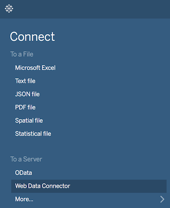
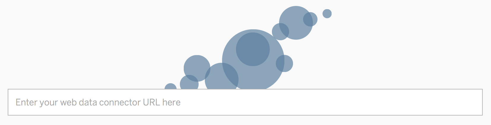
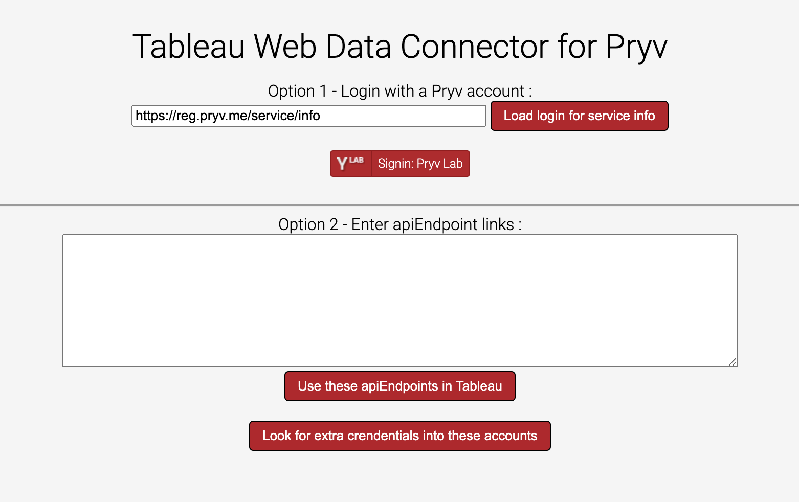
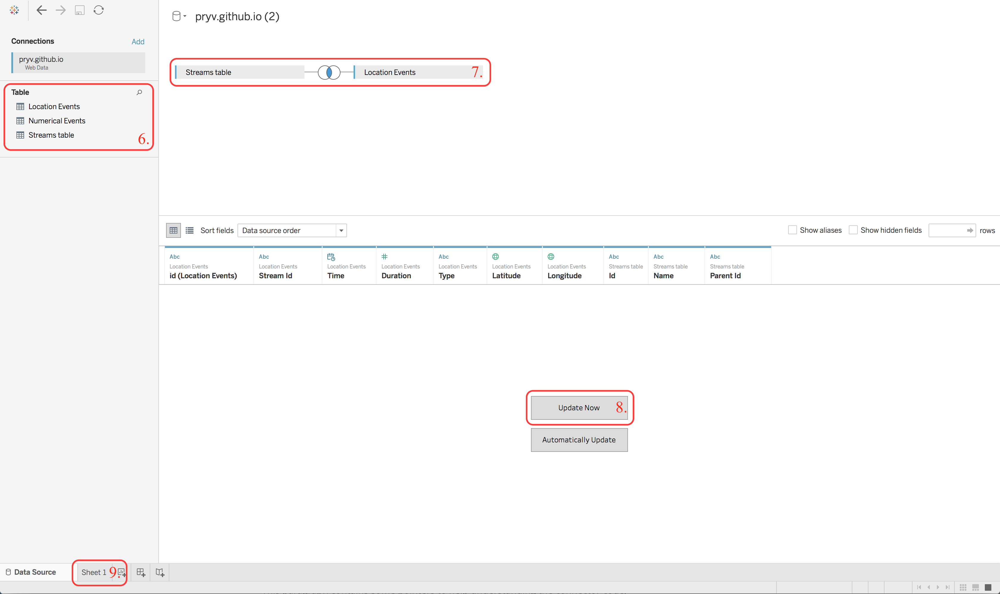

# Tableau integration for Pryv - Proof of Concept

Tableau Web data connector ([WDC](http://tableau.github.io/webdataconnector/docs/)) implementation for Pryv.io.

The connector uses WDC Version 2.2 and targets Tableau 10.0 and later.

_NOTE: Tableau refers either to [Tableau Desktop](https://www.tableau.com/products/desktop), for which you can have a free 14-day trial or [Tableau Public](https://public.tableau.com/s/), which you can use for free but with restrictions._

## Usage

1. In Tableau, under **Connect/To a Server**, choose **Web Data Connector**.

   

2. A new window opens, paste the following URL and press _Enter_ :

   > https://pryv.github.io/poc-integration-tableau/

   

3. _(Optional)_ You can adapt the previous URL in order to pass custom settings:

   If you want to change the Pryv.IO platform (default is _pryv.me_) :

   `https://pryv.github.io/poc-integration-tableau/?pryvServiceInfoUrl=https://reg.{YOURDOMAIN}/service/info`

4. Connect a Pryv.io account, you have two possibilities here :

  * Use the **Sign in** button to login to your Pryv.IO account and authorize Tableau to access it.

  * Use Pryv.io apiEndpoint(s) by pasting the link(s) in the appropriate input field and click on **Use apiEndpoints**.

  * You may want to load credentials contained into events of type: `'credentials/pryv-api-endpoint'` from these accounts with "Look for extra crendentials into these accounts"

  

5. Some selectors (time range, measurements limit) appear, you can use them to filter the data to be retrieved from Pryv.IO, then click on **Get Data**.

6. You should now have access to 3 tables in Tableau; **Streams**, **Location Events** and **Numerical Events**. Double-click on any of these tables to add them in the schema view, you can also join multiple tables.

   

7. Click on **Update now** to fill the tables with data.

8. Click the **Sheet** tab to begin your analysis in a new worksheet.

You are ready to analyse your Pryv.IO data in Tableau!

Here is some additional links to get started with Tableau:

   * [Get Started with Tableau Desktop](https://onlinehelp.tableau.com/current/guides/get-started-tutorial/en-us/get-started-tutorial-home.html)
   * [Build a Basic View to Explore Your Data](https://onlinehelp.tableau.com/current/pro/desktop/en-us/getstarted_buildmanual_ex1basic.html)

## Contribute

This paragraph contains some pointers to help understanding the connector code,
in case you want to fork it and adapt it to your own needs.

### Tableau part

First of all, we include the [Tableau WDC sdk](https://connectors.tableau.com/libs/tableauwdc-2.2.latest.js) in the **index.html**.

```html
<script src="https://connectors.tableau.com/libs/tableauwdc-2.2.latest.js" type="text/javascript"></script>
```

It gives access to a tableau object, which will be used to define the Tableau logic.

#### Initialization

In **connector.js**, we first instantiate our Tableau connector :

```javascript
const myConnector = tableau.makeConnector();
```

We then define the `myConnector.init` function, which will be called at the start of every Tableau phase (see [Phase 1](#phase-1-authentication) and [Phase 2](#phase-2-data-gathering)). The main tasks of this function is to tell tableau that we want a custom authentication type  (see [Phase 1](#phase-1-authentication)) :

```javascript
tableau.authType = tableau.authTypeEnum.custom;
```

and to save Pryv's credentials in Tableau so that they persist between phases.

Finally, we define the `myConnector.getData/getSchema` functions (see [Phase 2](#phase-2-data-gathering)) and conclude the connector initialization by registering it:

```javascript
tableau.registerConnector(myConnector);
```

#### Phase 1: Authentication

By default, the connector will start with Tableau authentication phase, which will show a popup with a form to provide Tableau credentials.

We have to replace this default authentication phase with Pryv authentication (see [Pryv authentication](#authentication)), by telling Tableau that we want a custom authentication type (as explained in [Initialization](#initialization)) or directly by aborting the current Tableau phase:

```javascript
tableau.abortForAuth();
```

Once authenticated, we show a submit button (declared in **index.html**) that will call Tableau submit function on user click and start the data gathering phase:

```html
<button id="submitButton" onclick="tableau.submit();">Get last 10'000 Data</button>
```

#### Phase 2: Data gathering

In order to complete the configuration of the Tableau connector logic, we have to provide two additional functions that will be called to gather and structure the data, once authentication is successful.

##### Schema definition

Firstly, we define our data schema in the `myConnector.getSchema` function, by enumerating the tables in which we will store the data and their corresponding columns.

Tables are simple objects containing an id, an alias and an array of columns :

```javascript
const streamTable = {
	id: "stream",
	alias: "Streams table",
	columns: stream_cols
};
```

A column is defined by an id, an alias, a data type and can optionally specify a foreign key (a relation to another column) :

```javascript
{
	id: "parentId",
	alias: "parentId",
	dataType: tableau.dataTypeEnum.string,
	foreignKey: {tableId: 'stream', columnId: 'id'}
}
```

In our case, the schema contains the following three tables;  **streamTable** for Pryv.IO Streams, **eventNumTable** for Pryv.IO numerical events and **eventLocationTable** : for Pryv.IO location Events.

##### Retrieving the data

Secondly, we define how and where Tableau will retrieve data by implementing the `myConnector.getData` function.

Since this function will be called once for each table of our schema, we have to check the current table id and call the appropriate retrieval method :

```javascript
switch (table.tableInfo.id) {
	case 'stream':
		getStreams(table, doneCallback);
		break;
	case 'eventNum':
		getNumEvents(table, doneCallback);
		break;
	case 'eventLocation':
		getLocationEvents(table, doneCallback);
	break;
}
```

The exact implementation of the retrieval methods will be covered in the Pryv.IO section (see [Pryv data gathering](#data-gathering)).

### Pryv.IO

For Pryv.IO logic, we import our javascript library in the **index.html** :

```html
<script type="text/javascript" src="https://api.pryv.com/lib-js/latest/pryv.js"></script>
```

It gives access to a pryv.io object that will be used for authentication/connection to Pryv.IO as well as for some utility functions.

We also add a login button that will allow the user to authenticate with a Pryv.IO account, as well as a resetState button :

```html
<!-- It does not look like a button yet, onclick event will be affected to it later. -->
<span id="pryv-button"></span>
<button id="pryv-resetState">resetState</button>
```

#### Data gathering

We implemented three functions that define how Tableau will collect data and fill each table we previously declared during [schema definition](#schema-definition).

##### Get Streams

The `getStreams` function uses the current Pryv connection to perform a GET call to Pryv.IO API, on the Streams route, then parse the resulting Streams and append them as rows of the corresponding table (`appendStreams` => `table.appendRows`).

##### Get Location Events

The `getLocationEvents` function relies on the `getEvents` function, which works similarly to `getStreams`, but targets the Events route and provides an additional Pryv.IO filter in order to only retrieve Events of type location (_'position/wgs84'_). This filter can be further configured by the user, as explained in [Usage](#usage) step 5.

Then, as for Streams, we parse the resulting Events and append them as rows of the corresponding table (`appendEvents` => `table.appendRows`).

##### Get Numerical Events

Finally, retrieval of numerical Events through `getNumEvents` function follows the same steps as for location Events with the only difference that we use this time a post-filtering function to limit the resulting Events to numerical measurements:

```javascript
const postFilter = function (event) {
	return (!isNaN(parseFloat(event.content))
		&& isFinite(event.content));
};
```

While Pryv.IO Filters will perform the filtering on the API side, the post-filtering are applied by the connector, after the Events have been retrieved from Pryv.

## Dev

To develop and debug the app you may want to use the following scheme
 Looks at options [Debugging tableau remotely with Chromium](https://tableau.github.io/webdataconnector/docs/wdc_debugging.html#start-tableau-with-remote-debugging-enabled-macos)

1. use [rec.la](https://www.rec.la) - install in local with `npm install rec.la -g` and run `rec.la ./`

2. From tableau or the simulator open the WebData Connector pane

3. Use `https://l.rec.la:4443` as source link

## Support and warranty

Pryv provides this software for educational and demonstration purposes with no support or warranty.

## License

[Revised BSD license](https://github.com/pryv/documents/blob/master/license-bsd-revised.md)

Don't hesitate to contribute to this repository. The Pryv.IO user community will be grateful!
